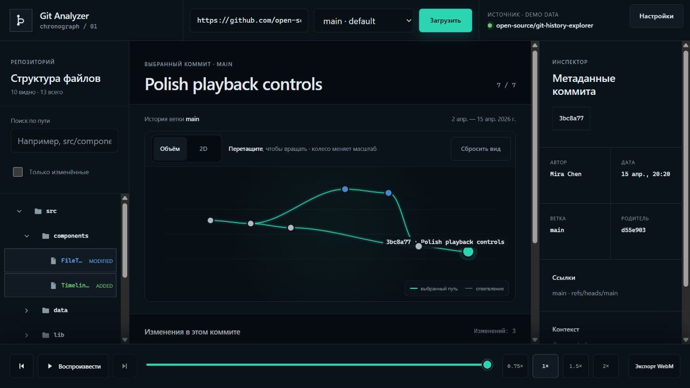

# Git Analyzer

**Explore a repository's history as an interactive graph, file tree, and commit timeline.**

[](https://github.com/Tah10n/git_analyser/actions/workflows/ci.yml)
[](LICENSE)

Git Analyzer helps you trace branches and merges, inspect the files present at a
commit, and play back how a GitHub repository evolved. It runs in your browser,
starts with a bundled demo, and can use an optional local Git analyzer for a
larger history window. The interface is currently in Russian.



*Bundled demo data. The screenshot shows the actual application.*

## What you can do

- **Navigate history visually.** Switch between 2D lanes and a rotatable 3D
  graph; select nodes, zoom, or scrub through the timeline.
- **Follow branches and merges.** Choose a branch and inspect parent links
  within the loaded history window.
- **Inspect each commit.** Browse its file tree, author, timestamp, SHA, refs,
  and added, modified, deleted, or renamed paths.
- **Focus on relevant files.** Search paths, show only changed files, and
  expand folders in a virtualized tree.
- **Play and share a sequence.** Adjust playback speed and export a WebM
  summary of the loaded commits.
- **Choose your appearance.** Dark, light, and IDE themes, with a collapsible
  repository panel on smaller screens.

## Run locally

Install **Node.js 22.12+**, **npm 10+**, and **Git**. CI checks Node.js 22 and 24;
Git is also used by the analyzer regression tests.

```sh
git clone https://github.com/Tah10n/git_analyser.git
cd git_analyser
npm ci
npm run dev
```

Open the URL printed by Vite (normally `http://127.0.0.1:5173`). The demo works
without a GitHub token. To inspect a repository, enter `Tah10n/git_analyser`,
press **Загрузить** (Load), and select a branch.

For a local production preview:

```sh
npm run build
npm run preview
```

The build output is `dist/` and can be served by a static host. No Node server
is needed for browser-only use.

## Choose a loading mode

| | Browser (default) | Optional analyzer |
| --- | --- | --- |
| Data source | GitHub REST API | A temporary Git clone |
| App history window | Up to 20 recent commits | Up to 500 commits |
| Setup | Start the frontend | Start the analyzer and set `VITE_ANALYZER_URL` |
| GitHub token | Optional, sent to `api.github.com` | The frontend token is never forwarded |
| Failure behavior | Visible API error or size warning | Falls back to the browser's 20-commit window |

The analyzer endpoint itself accepts up to 1,000 commits per request. These
limits bound commit counts, not total memory or execution time. See the
[analyzer guide](docs/analyzer.md) for the two-terminal setup and response contract.

## Scope and limitations

- History is a recent window of the selected branch, including reachable merge
  ancestry. It is not an all-branches or complete-history view. There is no
  user-facing history-limit control yet.
- The browser branch picker loads the first 100 branches; a branch named in an
  input URL is also looked up separately. The bundled analyzer returns its
  selected branch only.
- Trees follow first-parent ancestry. Window boundaries and analyzer merges use
  explicit tree snapshots. Browser commit changes are paginated; at GitHub's
  3,000-file cap, an extra tree request preserves the snapshot where possible,
  while the changed-file list may remain incomplete.
- GitHub rate limits and recursive-tree truncation still apply. Snapshots are
  retained in memory, so a large tree can remain expensive even with few commits.
- File contents and patch diffs are not displayed. WebM export creates a
  separate commit-summary animation, not a recording of the interactive graph.
  Export requires canvas capture and a supported WebM `MediaRecorder` codec.
- Cached histories do not expire automatically. Clear the cache before reloading
  when you need the latest repository state.

## Storage and configuration

**Настройки** (Settings) contains the optional GitHub token, theme controls, and
**Очистить кэш** (Clear cache). The token is saved in browser `localStorage`;
history metadata and paths are cached in IndexedDB on the same browser origin.
Clearing the token and clearing the cache are separate actions.

The default mode sends requests directly to GitHub. Configuring an analyzer
also sends the repository URL, requested branch, and commit limit to that
service. `VITE_ANALYZER_URL` is a build-time frontend setting: use it for an
endpoint address, never a credential.

## Documentation

- [Usage guide](docs/usage.md) — loading, graph controls, storage, and troubleshooting.
- [Analyzer guide](docs/analyzer.md) — setup, API, constraints, and fallback behavior.
- [Contributing](CONTRIBUTING.md) — development checks and browser verification.
- [Report a bug or request a feature](https://github.com/Tah10n/git_analyser/issues/new/choose).

Built with React, TypeScript, Vite, Canvas 2D, IndexedDB, and an optional Node.js
HTTP service. The npm package name is `git-history-explorer`.

## License

Licensed under [Apache-2.0](LICENSE).
